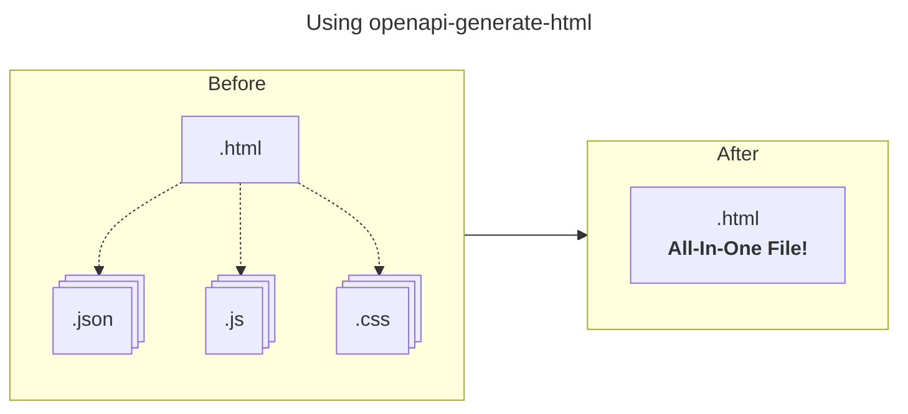
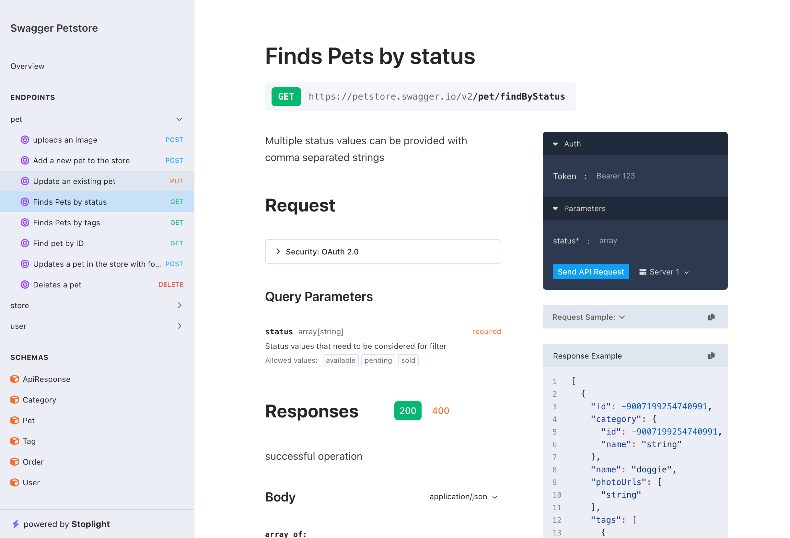
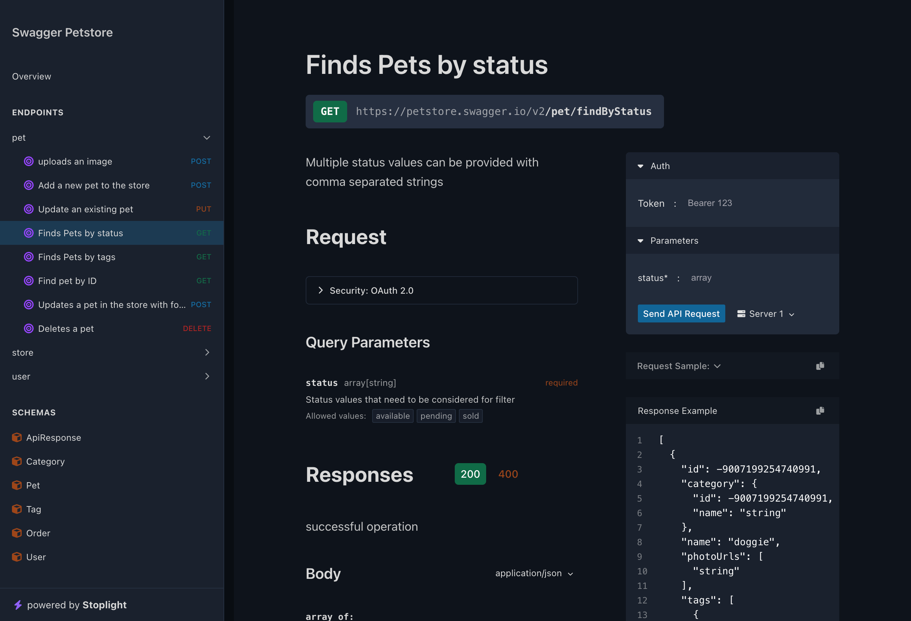
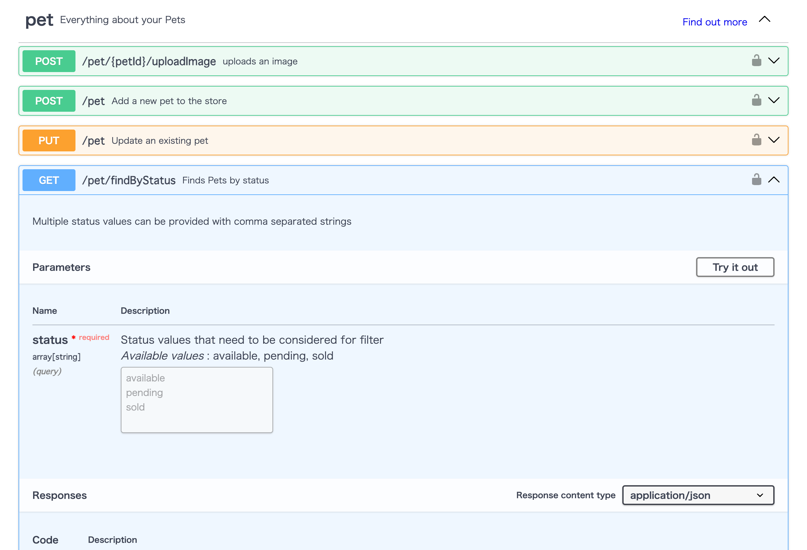
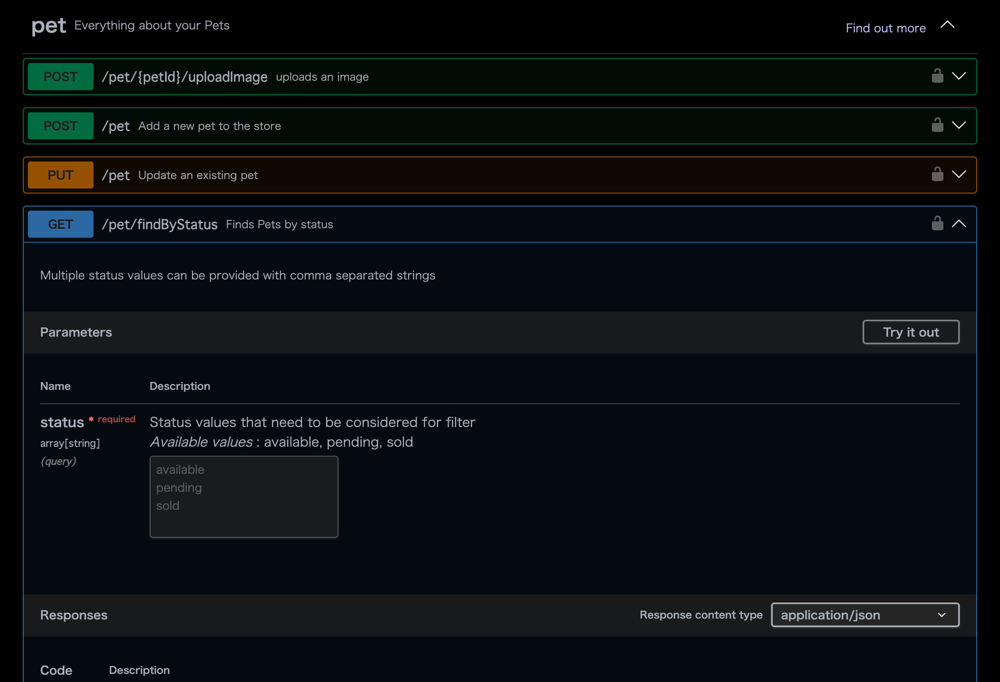
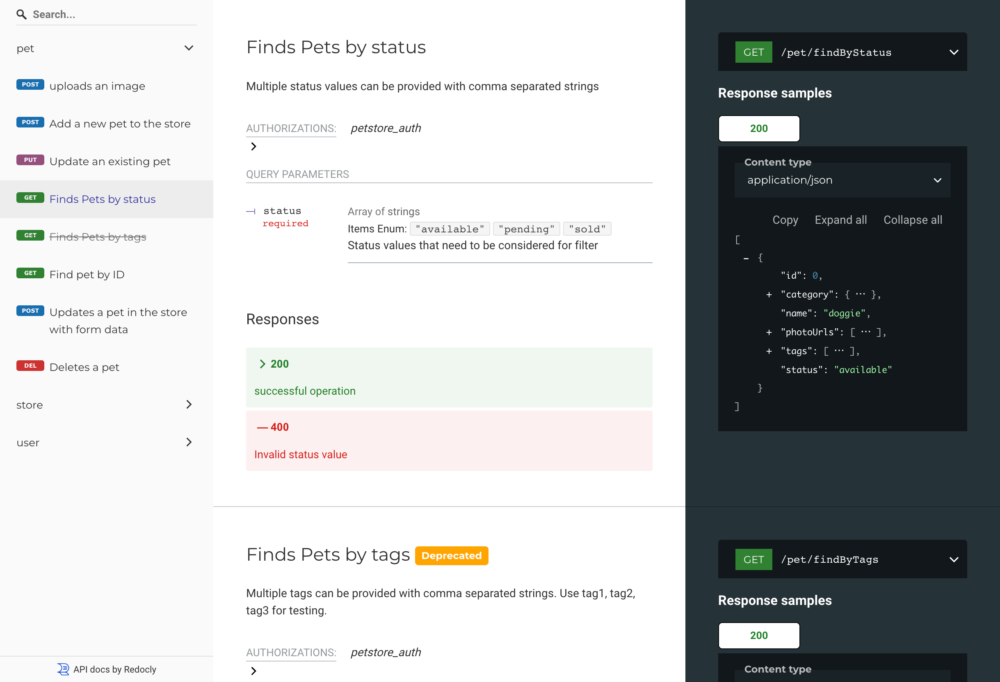
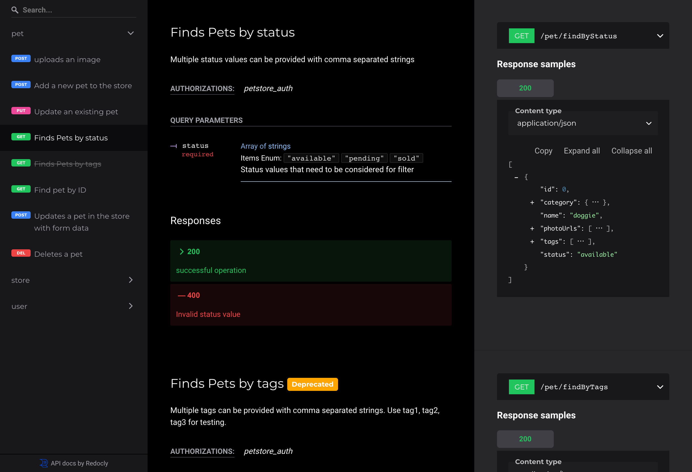

# openapi-generate-html

Generate standalone HTML from OpenAPI Specification. 

## Feature

One of the key benefits of `openapi-generate-html` is its portability.

By generating a single, self-contained HTML file, all required assets (CSS, JavaScript, and OpenAPI data) are embedded directly in the document.

This makes it easy to:

1. **Share** : the file as a single, standalone document without additional dependencies.
2. **Hosting** : the file on any server or serve it locally, with no need for additional resources or configurations.
3. **Distribute** : the file via email or other methods, knowing that it will display consistently across environments.

This portability makes `openapi-generate-html` ideal for situations where reliable, standalone documentation is required.



## How to use

```bash
npx openapi-generate-html -i openapi.json
```

Use dark theme 🌙

```bash
npx openapi-generate-html -i openapi.json --theme=dark
```

> [!NOTE]
> The dark theme is an experimental feature 🧪

## CLI Options

| command       | default        | description                             |
| ------------- | -------------- | --------------------------------------- |
| --input (-i)  |                | Input OpenAPI JSON / YAML file path     |
| --output (-o) | "openapi.html" | Output HTML file name                   |
| --ui          | "stoplight"    | Choose UI (stoplight / swagger / redoc) |
| --theme       | "light"        | Choose Theme (light / dark)             |
| --title       | "OpenAPI Docs" | Title of the HTML page                  |

## UI Pattern

|           | Light                                                                       | Dark 🧪                                                                  |
| --------- | :-------------------------------------------------------------------------: | :----------------------------------------------------------------------: |
| Stoplight |  `--ui=stoplight --theme=light` |  `--ui=stoplight --theme=dark` |
| Swagger   |  `--ui=swagger --theme=light`       |  `--ui=swagger --theme=dark`       |
| Redoc     |  `--ui=redoc --theme=light`             |  `--ui=redoc --theme=dark`             |

## License

This project is licensed under the terms of the [MIT license](./LICENSE).
