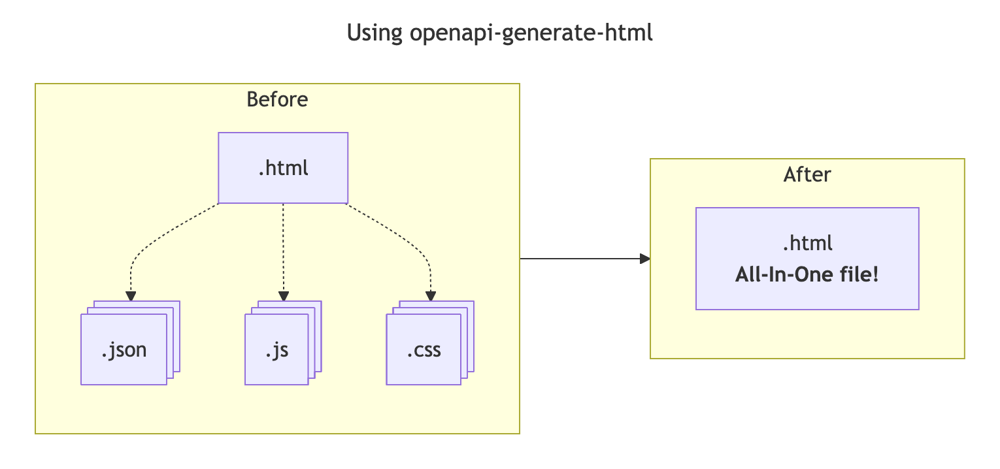
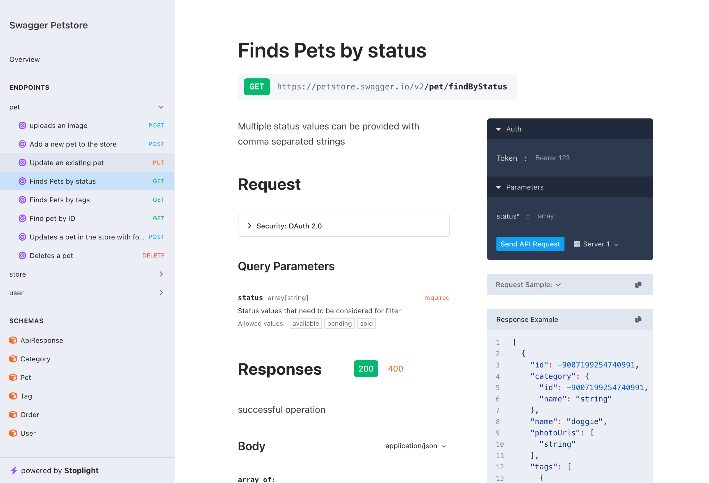
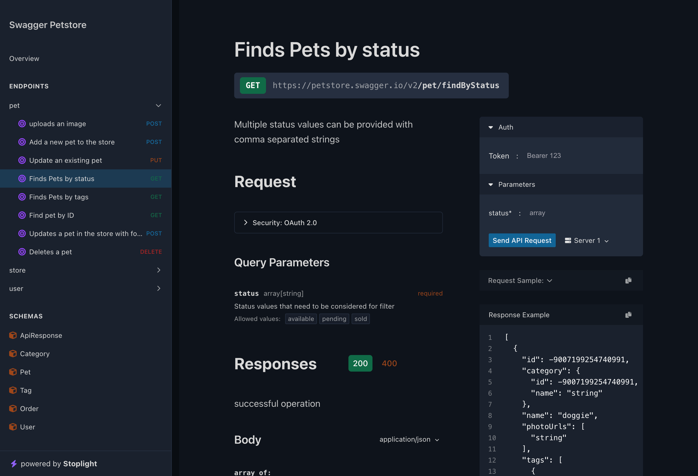
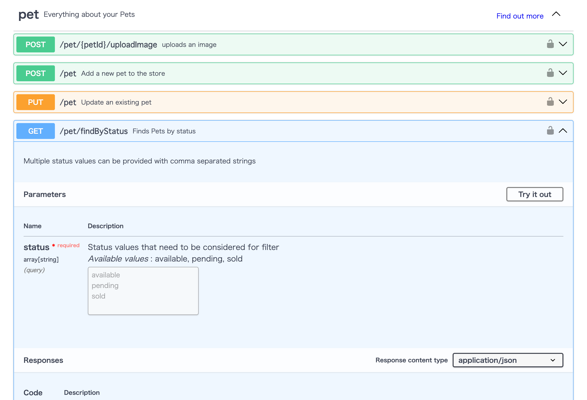
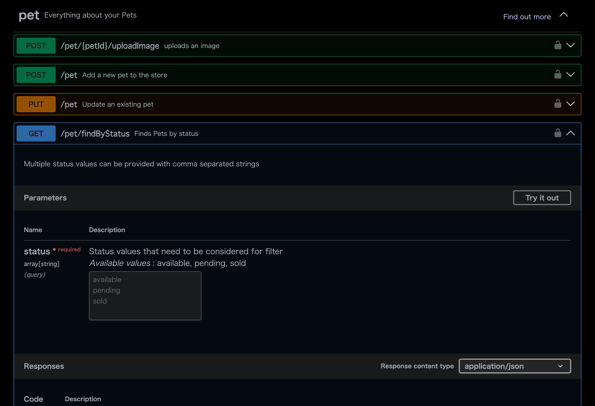
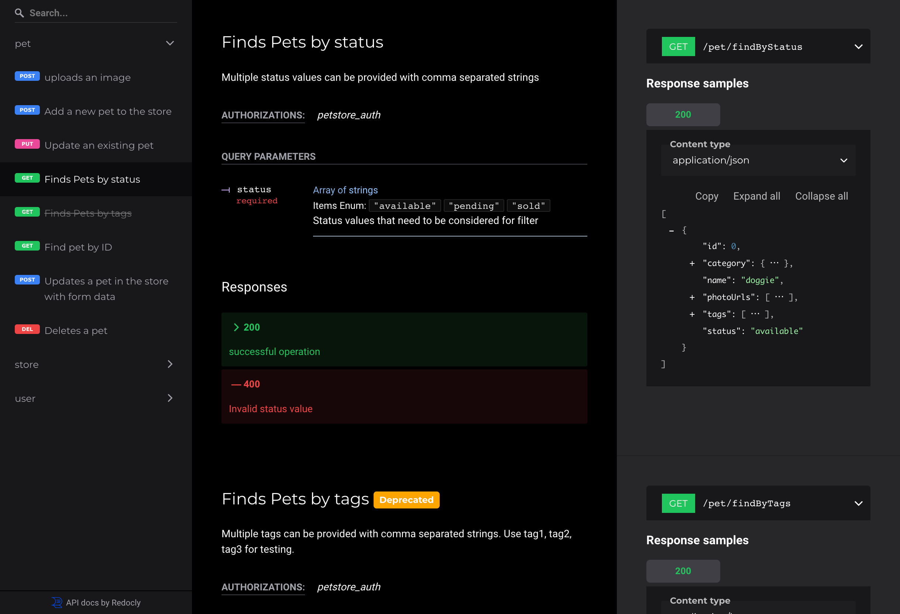

# openapi-generate-html


[](https://badge.fury.io/js/maplibre-gl-compass)
[](LICENSE)

Generate standalone HTML from OpenAPI Specification. 

## Feature

One of the key benefits of `openapi-generate-html` is its portability.

By generating a single, self-contained HTML file, all required assets (CSS, JavaScript, and OpenAPI data) are embedded directly in the document.

This makes it easy to:

1. **Share** : the file as a single, standalone document without additional dependencies.
2. **Hosting** : the file on any server or serve it locally, with no need for additional resources or configurations.
3. **Distribute** : the file via email or other methods, knowing that it will display consistently across environments.

This portability makes `openapi-generate-html` ideal for situations where reliable, standalone documentation is required.



## How to use

```bash
npx openapi-generate-html -i openapi.json
```

Use dark theme 🌙

```bash
npx openapi-generate-html -i openapi.json --theme=dark
```

> [!NOTE]
> The dark theme is an experimental feature 🧪

## CLI Options

| command       | default        | description                             |
| ------------- | -------------- | --------------------------------------- |
| --input (-i)  |                | Input OpenAPI file path or URL          |
| --output (-o) | "openapi.html" | Output HTML file name                   |
| --ui          | "stoplight"    | Choose UI (stoplight / swagger / redoc) |
| --theme       | "light"        | Choose Theme (light / dark)             |
| --title       | "OpenAPI Docs" | Title of the HTML page                  |
| --description |                | Description of the HTML page            |

## UI Pattern

|           | Light                                                                                                                                                                                | Dark 🧪                                                                                                                                                                         |
| --------- | :----------------------------------------------------------------------------------------------------------------------------------------------------------------------------------: | :------------------------------------------------------------------------------------------------------------------------------------------------------------------------------: |
| Stoplight |  <br> `--ui=stoplight --theme=light` <br> [sample](https://qazsato.github.io/openapi-generate-html/exmaples/stoplight-light.html) |  <br> `--ui=stoplight --theme=dark` <br> [sample](https://qazsato.github.io/openapi-generate-html/exmaples/stoplight-dark.html) |
| Swagger   |  <br> `--ui=swagger --theme=light` <br> [sample](https://qazsato.github.io/openapi-generate-html/exmaples/swagger-light.html)         |  <br> `--ui=swagger --theme=dark` <br> [sample](https://qazsato.github.io/openapi-generate-html/exmaples/swagger-dark.html)         |
| Redoc     |  <br> `--ui=redoc --theme=light` <br> [sample](https://qazsato.github.io/openapi-generate-html/exmaples/redoc-light.html)                 |  <br> `--ui=redoc --theme=dark` <br> [sample](https://qazsato.github.io/openapi-generate-html/exmaples/redoc-dark.html)                 |

## License

This project is licensed under the terms of the [MIT license](./LICENSE).
