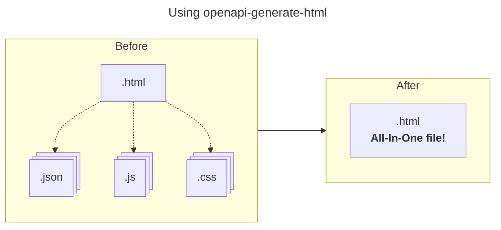

```mermaid
---
title: Using openapi-generate-html
---
flowchart LR
    subgraph After
    A1["`.html<br> **All-In-One file!** `"]
    end
    subgraph Before
    B1[.html] -.-> B2@{ shape: procs, label: ".json"}
    B1[.html] -.-> B3@{ shape: procs, label: ".js"}
    B1[.html] -.-> B4@{ shape: procs, label: ".css"}
    end
    Before ---> After
```